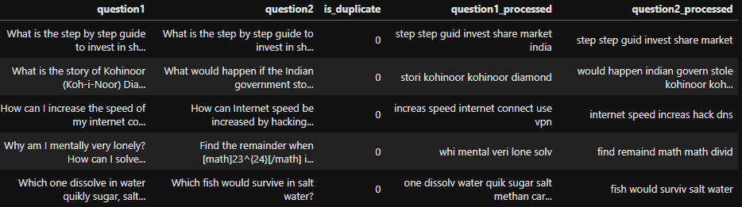
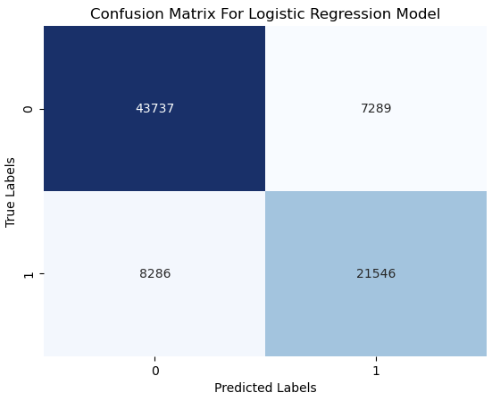
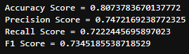
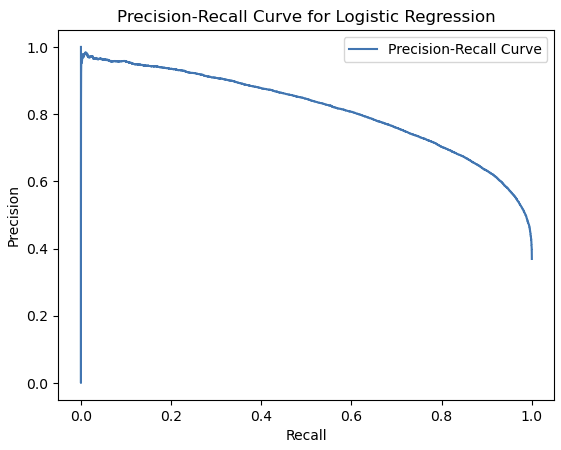

# Natural Language Processing Project 

## Project/Goals
This project aims to build a machine learning model that can predict if two given questions are duplicates or not. The dataset used for this project contains pairs of questions along with a binary label indicating if the questions are duplicates or not. The model will be trained using various features extracted from the questions such as the number of unique words and the TF-IDF vectors of the preprocessed questions.

## Project Flow 

1. EDA
2. Cleaning
3. Feature Engineering
4. Model
5. Evaluation / Results

The project involves several steps such as data preprocessing, feature extraction, and model training. The data preprocessing step involves cleaning the raw data by removing stop words, punctuations, and converting the text into lowercase. The feature extraction step involves transforming the preprocessed text into TF-IDF vectors and extracting other features such as the number of unique words and the word count. The final step involves training a machine learning model, such as logistic regression, using the extracted features.

## Results

The model I had time to build was the logistics regression model. This model type best fits sentiment analysis tasks that involve binary classification just like ours. As we are trying to predict the binary outcome of either duplicate or non duplicate. 

From the confusion matrix we can see a lot of the questions were classified as true positives or duplicates and the other majority were true negatives or non-duplicates.  

Looking into more detail the evaluation metrics tell us much more about this model:

- For example the accuracy score of 0.80 means the model was able to predict 80% of the questions with a precision score of 74%

- The recall score shows us the percentage the model correctly identified as positives which is around 72%

- Here we can see the precision-recall curve which is decent 

- This curve shows us the probability at which the model predicts the positive class depending on the tradeoff between recall and precision .

## Challenges & Future
For challenges, I found it hard to vectorize the questions and combine them into my dataframe as I had to compress the data since my computer could not store it within my RAM capacity.

For the future I would like to test out more models and create some more unique features within the dataset.

